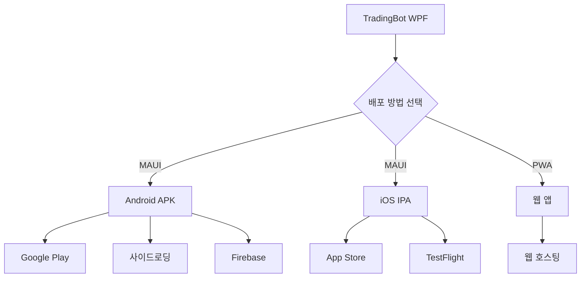

# 📱 모바일 배포 퀵스타트

## 🎯 목표
TradingBot을 Android/iOS 모바일 앱으로 배포하기

---

## ⚡ 30초 요약

### Android APK 빌드
```powershell
# 1. MAUI 워크로드 설치
dotnet workload install maui-android

# 2. APK 빌드
.\build-android.ps1

# 완성! bin\Debug\net9.0-android\*.apk 생성됨
```

### 전체 가이드
자세한 내용은 [MOBILE_DEPLOYMENT.md](MOBILE_DEPLOYMENT.md) 참고

---

## 📋 사전 준비 (한 번만)

### Windows에서 Android 개발

**필수 도구**
1. ✅ Visual Studio 2022 (v17.8+)
2. ✅ .NET 9.0 SDK
3. ✅ Android SDK (Visual Studio Installer)

**설치 방법**
```powershell
# Visual Studio Installer 실행
# "워크로드" 탭에서 선택:
# ☑ .NET Multi-platform App UI development

# 또는 명령줄로 설치
dotnet workload install maui-android
```

### macOS에서 iOS 개발

**필수 도구**
1. ✅ macOS (Xcode 실행 필수)
2. ✅ Xcode 15+
3. ✅ .NET 9.0 SDK for macOS
4. ✅ Apple Developer Account ($99/년)

---

## 🚀 Android APK 빌드 (3단계)

### 1단계: 워크로드 설치
```powershell
# MAUI Android 개발 도구 설치 (첫 실행 시만)
dotnet workload install maui-android

# 설치 확인
dotnet workload list
# 출력에 "maui-android" 표시되어야 함
```

### 2단계: 프로젝트 준비

**CoinFF.Mobile.csproj 최소 설정**
```xml
<Project Sdk="Microsoft.NET.Sdk">
  <PropertyGroup>
    <TargetFrameworks>net9.0-android</TargetFrameworks>
    <OutputType>Exe</OutputType>
    <UseMaui>true</UseMaui>
    
    <ApplicationTitle>TradingBot Monitor</ApplicationTitle>
    <ApplicationId>com.tradingbot.monitor</ApplicationId>
    <ApplicationVersion>1</ApplicationVersion>
  </PropertyGroup>

  <ItemGroup>
    <PackageReference Include="Microsoft.Maui.Controls" Version="9.0.0" />
  </ItemGroup>
</Project>
```

### 3단계: 빌드 및 설치

**스크립트 사용 (권장)**
```powershell
# 디버그 APK 빌드
.\build-android.ps1

# 릴리스 APK 빌드
.\build-android.ps1 -Configuration Release

# 빌드 + 연결된 기기에 바로 설치
.\build-android.ps1 -Install
```

**수동 빌드**
```powershell
cd TradingBot
dotnet build CoinFF.Mobile.csproj -f net9.0-android -c Debug
```

**출력 위치**
```
TradingBot\bin\Debug\net9.0-android\com.tradingbot.monitor-Signed.apk
```

---

## 📲 APK 설치 방법

### 방법 1: USB 연결 (개발자용)
```powershell
# Android 기기 USB 디버깅 활성화
# 설정 > 개발자 옵션 > USB 디버깅

# ADB로 설치
adb install -r bin\Debug\net9.0-android\*.apk
```

### 방법 2: 파일 전송 (일반 사용자)
```powershell
# 1. APK 파일을 기기로 전송 (이메일, USB, 클라우드 등)

# 2. Android 기기에서
# 설정 > 보안 > "알 수 없는 출처" 허용

# 3. APK 파일 탭하여 설치
```

### 방법 3: QR 코드 (베타 테스터)
```powershell
# APK를 웹 서버에 업로드
Copy-Item bin\Debug\*.apk -Destination "C:\inetpub\wwwroot\downloads\"

# QR 코드 생성 (온라인 도구 사용)
# URL: https://yoursite.com/downloads/tradingbot.apk

# 테스터에게 QR 코드 전달
```

---

## 🍎 iOS 빌드 (Mac 필요)

### Mac에서 실행
```bash
# 1. .NET SDK 설치 확인
dotnet --version

# 2. MAUI 워크로드 설치
dotnet workload install maui-ios

# 3. 프로젝트로 이동
cd /path/to/TradingBot

# 4. iOS 빌드
dotnet build TradingBot/CoinFF.Mobile.csproj -f net9.0-ios -c Debug

# 5. 시뮬레이터 실행
open -a Simulator
dotnet build -t:Run -f net9.0-ios
```

### Xcode에서 배포
```bash
# 1. Archive 생성
dotnet publish -f net9.0-ios -c Release

# 2. Xcode에서 열기
open TradingBot/bin/Release/net9.0-ios/TradingBot.app

# 3. Product > Archive

# 4. Organizer에서 "Distribute App" 선택
```

---

## 🌐 대안: PWA (모든 플랫폼)

앱 스토어 없이 모바일 배포 가능!

### 1. Blazor WebAssembly 프로젝트 생성
```powershell
dotnet new blazorwasm -n TradingBot.Web -o TradingBot.Web
cd TradingBot.Web
```

### 2. PWA 지원 추가
```powershell
# wwwroot/manifest.json 생성
@"
{
  "name": "TradingBot Monitor",
  "short_name": "TradingBot",
  "start_url": "/",
  "display": "standalone",
  "icons": [
    {"src": "icon-512.png", "sizes": "512x512", "type": "image/png"}
  ]
}
"@ | Out-File -Encoding UTF8 wwwroot/manifest.json
```

### 3. 빌드 및 배포
```powershell
# 빌드
dotnet publish -c Release -o publish

# 웹 서버에 배포 (예: Azure, Netlify, Vercel)
# 사용자는 브라우저에서 "홈 화면에 추가" 선택
```

---

## 🎨 UI 예제 (MAUI)

### 간단한 대시보드 페이지
```xml
<!-- MainPage.xaml -->
<ContentPage xmlns="http://schemas.microsoft.com/dotnet/2021/maui"
             Title="TradingBot">
    <ScrollView>
        <VerticalStackLayout Padding="20" Spacing="15">
            <!-- 총 자산 -->
            <Frame BackgroundColor="#1E293B" CornerRadius="10">
                <VerticalStackLayout>
                    <Label Text="총 자산" TextColor="Gray"/>
                    <Label Text="$12,345.67" FontSize="32" TextColor="#00E676" FontAttributes="Bold"/>
                </VerticalStackLayout>
            </Frame>

            <!-- 포지션 목록 -->
            <Label Text="활성 포지션" FontSize="18" FontAttributes="Bold" Margin="0,10,0,5"/>
            <CollectionView ItemsSource="{Binding Positions}">
                <CollectionView.ItemTemplate>
                    <DataTemplate>
                        <Frame Margin="0,5" Padding="15" BackgroundColor="#1E293B">
                            <Grid ColumnDefinitions="*,Auto">
                                <Label Text="{Binding Symbol}" FontSize="16" TextColor="White"/>
                                <Label Grid.Column="1" Text="{Binding PnL}" TextColor="{Binding PnLColor}" FontAttributes="Bold"/>
                            </Grid>
                        </Frame>
                    </DataTemplate>
                </CollectionView.ItemTemplate>
            </CollectionView>

            <!-- 제어 버튼 -->
            <Grid ColumnDefinitions="*,*" ColumnSpacing="10" Margin="0,20,0,0">
                <Button Text="시작" BackgroundColor="#00E676" TextColor="Black"/>
                <Button Grid.Column="1" Text="정지" BackgroundColor="#FF5252"/>
            </Grid>
        </VerticalStackLayout>
    </ScrollView>
</ContentPage>
```

---

## 🐛 문제 해결

### "Android SDK를 찾을 수 없습니다"
```powershell
# Visual Studio Installer 실행
# "수정" > "개별 구성 요소"
# ☑ Android SDK 설정 (API 34)

# 환경 변수 설정
$env:ANDROID_HOME = "C:\Program Files (x86)\Android\android-sdk"
```

### "MAUI 워크로드가 설치되지 않음"
```powershell
# 재설치 시도
dotnet workload uninstall maui-android
dotnet workload install maui-android

# 또는 Visual Studio에서
# 도구 > 명령줄 > 개발자 명령 프롬프트
# dotnet workload restore
```

### "APK 파일이 생성되지 않음"
```powershell
# 1. 자세한 로그 확인
dotnet build -v detailed

# 2. 정리 후 재빌드
dotnet clean
dotnet build

# 3. NuGet 복원
dotnet restore
```

---

## 📊 배포 플로우 요약



---

## 🎯 체크리스트

### Android 배포
- [ ] Visual Studio 2022 설치
- [ ] MAUI 워크로드 설치
- [ ] CoinFF.Mobile.csproj 설정
- [ ] 아이콘 및 리소스 추가
- [ ] Debug APK 빌드 성공
- [ ] 실제 기기에서 테스트
- [ ] Release APK 서명
- [ ] Google Play 개발자 계정 ($25)
- [ ] 스토어 등록 정보 준비
- [ ] 앱 심사 제출

### iOS 배포 (Mac 필요)
- [ ] macOS 준비
- [ ] Xcode 15+ 설치
- [ ] Apple Developer 계정 ($99/년)
- [ ] Certificate 및 Profile 생성
- [ ] iOS 빌드 성공
- [ ] TestFlight 베타 테스트
- [ ] App Store 제출

---

## 📚 추가 리소스

- **상세 가이드**: [MOBILE_DEPLOYMENT.md](MOBILE_DEPLOYMENT.md)
- **빌드 스크립트**: [build-android.ps1](build-android.ps1)
- **.NET MAUI 문서**: https://learn.microsoft.com/dotnet/maui/
- **Android 가이드**: https://developer.android.com/
- **Apple 가이드**: https://developer.apple.com/

---

## 💬 지원

문제가 발생하면:
1. [MOBILE_DEPLOYMENT.md](MOBILE_DEPLOYMENT.md)의 "문제 해결" 섹션 확인
2. GitHub Issues 등록
3. 텔레그램 커뮤니티 문의

---

**빠른 시작 완료!** 🎉

다음 단계: [MOBILE_DEPLOYMENT.md](MOBILE_DEPLOYMENT.md)에서 고급 기능 확인
